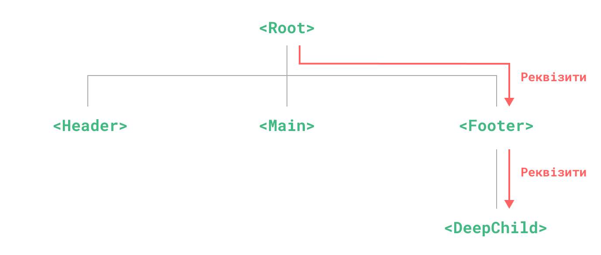
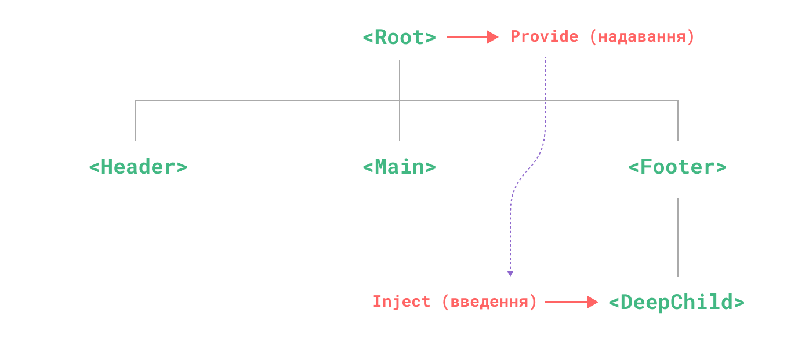

# Надавання / введення {#provide-inject}

> На цій сторінці передбачається, що ви вже прочитали [основи компонентів](/guide/essentials/component-basics). Прочитайте це спочатку, якщо ви новачок у компонентах.

## Прокидання реквізитів {#prop-drilling}

Зазвичай, коли нам потрібно передати дані від батьківського до дочірнього компонента, ми використовуємо [реквізити](/guide/components/props). Однак уявіть випадок, коли у нас є велике дерево компонентів, а глибоко вкладеному компоненту потрібне щось із компонента-предка. Маючи лише атрибути, ми мали б передати один і той самий атрибут по всьому батьківському ланцюжку:



<!-- https://www.figma.com/file/baI7BcyWw9apxsI4tZqLLA/prop-drilling-(Copy) -->

Зауважте, хоча компонент `<Footer>` може взагалі не піклуватися про ці атрибути, йому все одно потрібно оголосити та передати їх, щоб `<DeepChild>` міг отримати до них доступ. Якщо є довший батьківський ланцюг, більше компонентів буде задіяно на цьому шляху. Це називається «прокиданням реквізиту», і мати справу з ним точно нецікаво.

Ми можемо вирішити прокидання реквізитів за допомогою `provide` і `inject`. Батьківський компонент може служити **постачальником залежностей** для всіх своїх нащадків. Будь-який компонент у нащадковому дереві, незалежно від того, наскільки він глибокий, може **надавати** залежності, пропоновані компонентами в його батьківському ланцюжку.



<!-- https://www.figma.com/file/ipsCQpV1evpFwKfmVFSkdy/provide%2Finject-(Copy) -->

## Надавання {#provide}

<div class="composition-api">

Щоб надати дані нащадкам компонента, скористайтеся функцією [`provide()`](/api/composition-api-dependency-injection.html#provide):

```vue
<script setup>
import { provide } from 'vue'

provide(/* ключ */ 'message', /* значення */ 'привіт!')
</script>
```

Якщо не використовується `<script setup>`, переконайтеся, що `provide()` викликається синхронно в `setup()`:

```js
import { provide } from 'vue'

export default {
  setup() {
    provide(/* ключ */ 'message', /* значення */ 'привіт!')
  }
}
```

Функція `provide()` приймає два аргументи. Перший аргумент називається **ключем введення**, який може бути рядком або `Symbol`. Ключ введення використовується компонентами-нащадками для пошуку потрібного значення для введення. Один компонент може викликати `provide()` кілька разів з різними ключами введення, щоб надати різні значення.

Другим аргументом є надане значення. Значення може бути будь-якого типу, включаючи реактивний стан, наприклад референція:

```js
import { ref, provide } from 'vue'

const count = ref(0)
provide('key', count)
```

Надання реактивних значень дозволяє компонентам-нащадкам, використовуючи надане значення, встановити реактивне з'єднання з компонентом-провайдером.

</div>

<div class="options-api">

Щоб надати дані нащадкам компонента, скористайтеся параметром [`provide`](/api/options-composition.html#provide):

```js
export default {
  provide: {
    message: 'привіт!'
  }
}
```

Для кожної властивості в об'єкті `provide` ключ використовується дочірніми компонентами для пошуку правильного значення для введення, тоді як значення є тим, що вводиться в кінцевому підсумку.

Якщо нам потрібно надати стан кожного екземпляра, наприклад дані, оголошені за допомогою `data()`, тоді `provide` має використовувати значення функції:

```js{7-12}
export default {
  data() {
    return {
      message: 'привіт!'
    }
  },
  provide() {
    // використовуйте синтаксис функції, щоб ми могли отримати доступ до `this`
    return {
      message: this.message
    }
  }
}
```

Однак зауважте, що це *не* робить введення реактивним. Нижче ми обговоримо, [як зробити введення реактивними](#working-with-reactivity).

</div>

## Надання на рівні програми {#app-level-provide}

Окрім надання даних у компоненті, ми також можемо надати на рівні програми:

```js
import { createApp } from 'vue'

const app = createApp({})

app.provide(/* ключ */ 'message', /* значення */ 'привіт!')
```

Надавання на рівні програми доступне для всіх компонентів програми. Це особливо корисно під час написання [плагінів](/guide/reusability/plugins.html), оскільки плагіни зазвичай не можуть надавати значення за допомогою компонентів.

## Введення {#inject}

<div class="composition-api">

Щоб ввести дані, надані компонентом-предком, скористайтеся функцією [`inject()`](/api/composition-api-dependency-injection.html#inject):

```vue
<script setup>
import { inject } from 'vue'

const message = inject('message')
</script>
```

Якщо надане значення є референцію, воно буде введено як є і *не буде* автоматично розгорнуто. Це дозволяє компоненту-приймачу зберігати реактивний зв'язок з компонентом-надавачем.

[Повний приклад реактивного надавання та введення](https://sfc.vuejs.org/#eNqFUktOwzAQvcrIm4DUxvuqICEWXMIbk0ybVI1t2W4RqiIhOAA7tlwBIZAQ3yu4N2LchLSloqySmXnvJfPmLdiJMel8hmzAhi6zpfHg0M/MsVBlZbT1sACLox4Yq+dljlDDyOoKEuIkHea0KKd5O0j5qoqiBBCKczi/bOmlGoNs9HyBcGalylfoFSyTimYy8+A1ZIVUY3RQSGNQRWKBFlOhMq2chwqdk2OEo6h2kISv5VV4CY/Lu+V1cihU+7cHSYtLej8MGg55syntSIXHykylR6oAhqUyMw/zfqVznB4J1rIEa8bNopyKIe+IrMcaH/qVNOnEaUVuLiJetAMn2ABWndgjZ2ItWOG9cQPO3SiLdk1cqu2Y01tqZ8qXFaboqv651RcOLQkL1tvQ4NSco+1bVDlZY/dp/oLu6EbZWqiaVumu93ck1nfrbr5utYffZ/IGf9fKbaV9uSzVBCks24ncDUgDW0fhnwTET0SPw334jIEKT/R8D2/hOXyEj+UtxAaER3q/Ca/hgQ676L5Wk4mkwaPI5lr1N4fIQ3c=)

Знову ж таки, якщо не використовується `<script setup>`, `inject()` має викликатися лише синхронно в `setup()`:

```js
import { inject } from 'vue'

export default {
  setup() {
    const message = inject('message')
    return { message }
  }
}
```

</div>

<div class="options-api">

Щоб ввести дані, надані компонентом-предком, скористайтеся параметром [`inject`](/api/options-composition.html#inject):

```js
export default {
  inject: ['message'],
  created() {
    console.log(this.message) // введене значення
  }
}
```

Введення обчислюються **перед** власним станом компонента, тому ви можете отримати доступ до ввдених властивостей у `data()`:

```js
export default {
  inject: ['message'],
  data() {
    return {
      // вихідні дані на основі введеного значення
      fullMessage: this.message
    }
  }
}
```

[Повний приклад надавання та введення](https://sfc.vuejs.org/#eNqNUt1KwzAUfpVDbqqwNfelCOKFD2G8qOvZ1rGmIcmmMAqiD+Cdt76CDAVRp6+QvpEnbffnhg5Kk/P7fV/OmbFTpcLpBFnEYtPTmbInQma5KrSFs2E2TqGvixyCkNeWTw2EFBJv6pQU+8lkbGEmJECvoDqJ0poIZm112fERpYtpluLRcZMIoNFOtFxaADkakwwwgsB9V7fuzc2rx+qOkHyw9Af96Iv5iiQZFnM1TiySBRA3gJyMmK8irMMaNd08UeHIFJKU1rCiDRjBiG6DJBjp87ZgQ2uViTg3/Z4XPTJhoQecbqGeSJvlGKLJu1e6uDaoqbFgtdK2ByfnFHVXo0xRo/6r56/Unb5L9SRlNYN94zrXiUy3Z7Z2HT64RsW68rDH3wDfncA2jS3u++hkcoQ9G8FF0K5FcPkvvqoPAPfkvvzyuBc6P92He3ULt6gewDvAzel+797dMwmdLbcOynrDYu6bbDIvfwCPoid7)

### Псевдонім введення \* {#injection-aliasing}

У разі використання синтаксису масиву для `inject` введені властивості відображаються в екземплярі компонента за допомогою того самого ключа. У наведеному вище прикладі властивість було надано в ключі `"message"` і введено як `this.message`. Локальний ключ такий самий, як ключ введення.

Якщо ми хочемо ввести властивість за допомогою іншого локального ключа, нам потрібно використовувати синтаксис об'єкта для опції `inject`:

```js
export default {
  inject: {
    /* локальний ключ */ localMessage: {
      from: /* ключ введення */ 'message'
    }
  }
}
```

Тут компонент знайде властивість, надану ключем `"message"`, а потім представить його як `this.localMessage`.

</div>

### Стандартні значення введення {#injection-default-values}

За промовчанням `inject` передбачає, що введений ключ надано десь у батьківському ланцюжку. Якщо ключ не надано, з'явиться попередження під час виконання.

Якщо ми хочемо, щоб введена властивість працювала з додатковими надавачами, нам потрібно оголосити значення за промовчанням, подібне до реквізитів:

<div class="composition-api">

```js
// `value` буде "значенням за промовчанням"
// якщо не було надано жодних даних, що відповідають "message".
const value = inject('message', 'значенням за промовчанням')
```

У деяких випадках може знадобитися створити значення за промовчанням шляхом виклику функції або створення екземпляра нового класу. Щоб уникнути непотрібних обчислень або побічних ефектів у випадку, якщо необов'язкове значення не використовується, ми можемо використовувати фабричну функцію для створення значення за замовчуванням:

```js
const value = inject('key', () => new ExpensiveClass())
```

</div>

<div class="options-api">

```js
export default {
  // необхідний синтаксис об'єкта
  // при оголошенні значень за замовчуванням для надавання
  inject: {
    message: {
      from: 'message', // це необов’язково, якщо для введення використовується той самий ключ
      default: 'значенням за промовчанням'
    },
    user: {
      // використовувати функцію фабрики для непримітивних значень, які є дорогими
      // для створення, або такі, які мають бути унікальними для екземпляра компонента.
      default: () => ({ name: 'Степан' })
    }
  }
}
```

</div>

## Робота з реактивністю {#working-with-reactivity}

<div class="composition-api">

When using reactive provide / inject values, **it is recommended to keep any mutations to reactive state inside of the _provider_ whenever possible**. This ensures that the provided state and its possible mutations are co-located in the same component, making it easier to maintain in the future.

There may be times when we need to update the data from an injector component. In such cases, we recommend providing a function that is responsible for mutating the state:

```vue{7-9,13}
<!-- inside provider component -->
<script setup>
import { provide, ref } from 'vue'

const location = ref('North Pole')

function updateLocation() {
  location.value = 'South Pole'
}

provide('location', {
  location,
  updateLocation
})
</script>
```

```vue{5}
<!-- in injector component -->
<script setup>
import { inject } from 'vue'

const { location, updateLocation } = inject('location')
</script>

<template>
  <button @click="updateLocation">{{ location }}</button>
</template>
```

Finally, you can wrap the provided value with [`readonly()`](/api/reactivity-core.html#readonly) if you want to ensure that the data passed through `provide` cannot be mutated by the injected component.

```vue
<script setup>
import { ref, provide, readonly } from 'vue'

const count = ref(0)
provide('read-only-count', readonly(count))
</script>
```

</div>

<div class="options-api">

In order to make injections reactively linked to the provider, we need to provide a computed property using the [computed()](/api/reactivity-core.html#computed) function:

```js{10}
import { computed } from 'vue'

export default {
  data() {
    return {
      message: 'hello!'
    }
  },
  provide() {
    return {
      // explicitly provide a computed property
      message: computed(() => this.message)
    }
  }
}
```

[Full provide + inject Example with Reactivity](https://sfc.vuejs.org/#eyJBcHAudnVlIjoiPHNjcmlwdD5cbmltcG9ydCBDaGlsZCBmcm9tICcuL0NoaWxkLnZ1ZSdcbmltcG9ydCB7IGNvbXB1dGVkIH0gZnJvbSAndnVlJ1xuXG5leHBvcnQgZGVmYXVsdCB7XG4gIGNvbXBvbmVudHM6IHsgQ2hpbGQgfSxcbiAgZGF0YSgpIHtcbiAgICByZXR1cm4ge1xuICAgICAgbWVzc2FnZTogJ2hlbGxvJ1xuICAgIH1cbiAgfSxcbiAgcHJvdmlkZSgpIHtcbiAgICByZXR1cm4ge1xuICAgICAgbWVzc2FnZTogY29tcHV0ZWQoKCkgPT4gdGhpcy5tZXNzYWdlKVxuICAgIH1cbiAgfVxufVxuPC9zY3JpcHQ+XG5cbjx0ZW1wbGF0ZT5cbiAgPGlucHV0IHYtbW9kZWw9XCJtZXNzYWdlXCI+XG4gIDxDaGlsZCAvPlxuPC90ZW1wbGF0ZT4iLCJpbXBvcnQtbWFwLmpzb24iOiJ7XG4gIFwiaW1wb3J0c1wiOiB7XG4gICAgXCJ2dWVcIjogXCJodHRwczovL3NmYy52dWVqcy5vcmcvdnVlLnJ1bnRpbWUuZXNtLWJyb3dzZXIuanNcIlxuICB9XG59IiwiQ2hpbGQudnVlIjoiPHNjcmlwdD5cbmltcG9ydCBHcmFuZENoaWxkIGZyb20gJy4vR3JhbmRDaGlsZC52dWUnXG5cbmV4cG9ydCBkZWZhdWx0IHtcbiAgY29tcG9uZW50czoge1xuICAgIEdyYW5kQ2hpbGRcbiAgfVxufVxuPC9zY3JpcHQ+XG5cbjx0ZW1wbGF0ZT5cbiAgPEdyYW5kQ2hpbGQgLz5cbjwvdGVtcGxhdGU+IiwiR3JhbmRDaGlsZC52dWUiOiI8c2NyaXB0PlxuZXhwb3J0IGRlZmF1bHQge1xuICBpbmplY3Q6IFsnbWVzc2FnZSddXG59XG48L3NjcmlwdD5cblxuPHRlbXBsYXRlPlxuICA8cD5cbiAgICBNZXNzYWdlIHRvIGdyYW5kIGNoaWxkOiB7eyBtZXNzYWdlIH19XG4gIDwvcD5cbjwvdGVtcGxhdGU+In0=)

The `computed()` function is typically used in Composition API components, but can also be used to complement certain use cases in Options API. You can learn more about its usage by reading the [Reactivity Fundamentals](/guide/essentials/reactivity-fundamentals.html) and [Computed Properties](/guide/essentials/computed.html) with the API Preference set to Composition API.

:::warning Temporary Config Required
The above usage requires setting `app.config.unwrapInjectedRef = true` to make injections automatically unwrap computed refs. This will become the default behavior in Vue 3.3 and this config is introduced temporarily to avoid breakage. It will no longer be required after 3.3.
:::

</div>

## Working with Symbol Keys {#working-with-symbol-keys}

So far, we have been using string injection keys in the examples. If you are working in a large application with many dependency providers, or you are authoring components that are going to be used by other developers, it is best to use Symbol injection keys to avoid potential collisions.

It's recommended to export the Symbols in a dedicated file:

```js
// keys.js
export const myInjectionKey = Symbol()
```

<div class="composition-api">

```js
// in provider component
import { provide } from 'vue'
import { myInjectionKey } from './keys.js'

provide(myInjectionKey, {
  /* data to provide */
})
```

```js
// in injector component
import { inject } from 'vue'
import { myInjectionKey } from './keys.js'

const injected = inject(myInjectionKey)
```

See also: [Typing Provide / Inject](/guide/typescript/composition-api.html#typing-provide-inject) <sup class="vt-badge ts" />

</div>

<div class="options-api">

```js
// in provider component
import { myInjectionKey } from './keys.js'

export default {
  provide() {
    return {
      [myInjectionKey]: {
        /* data to provide */
      }
    }
  }
}
```

```js
// in injector component
import { myInjectionKey } from './keys.js'

export default {
  inject: {
    injected: { from: myInjectionKey }
  }
}
```

</div>
